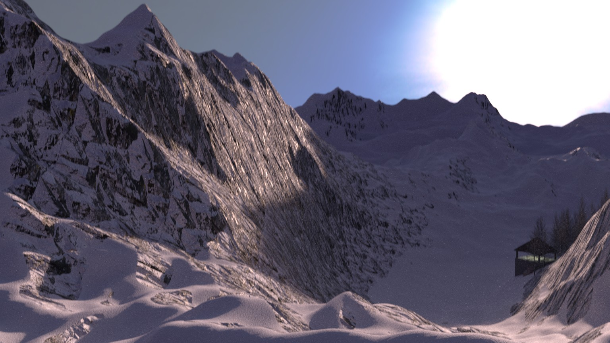

# BlenderMountain

The project was completed by Md. Mushfiqur Rahman for the graphics lab (CSE 4552), 2019. It was an individual task. The link to the rendered video can be found [here](https://drive.google.com/open?id=13SMYjFKaJVfjNv3Vzm4d2EqG0TqJsUaT). All the nevessary files for the build are added to the repository.

### Credits

- I took help from [this](https://www.youtube.com/watch?v=qSafYNQrodk&t=3679s) blender tutorial to build the mountains.
- The trees were built using the tree add-on of blender
